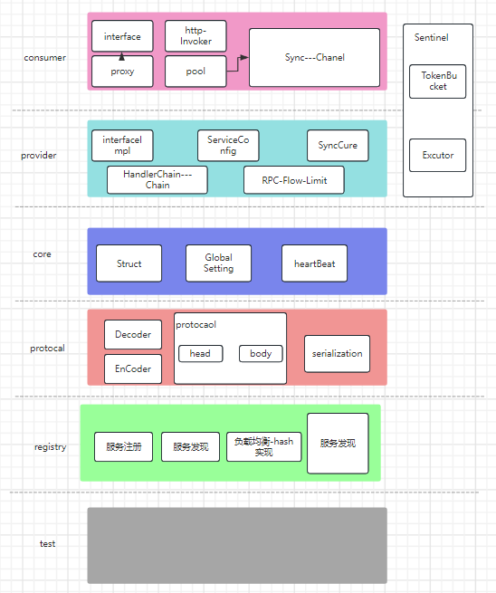
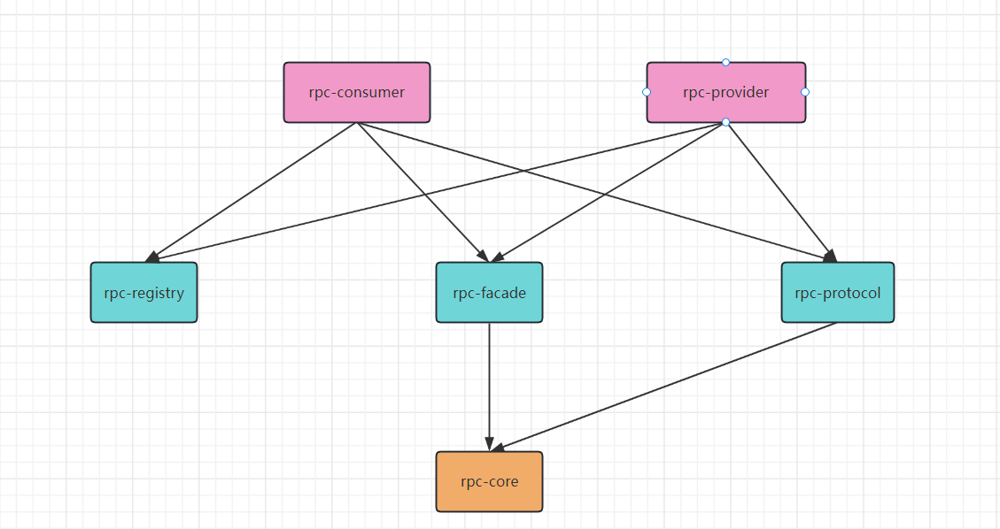
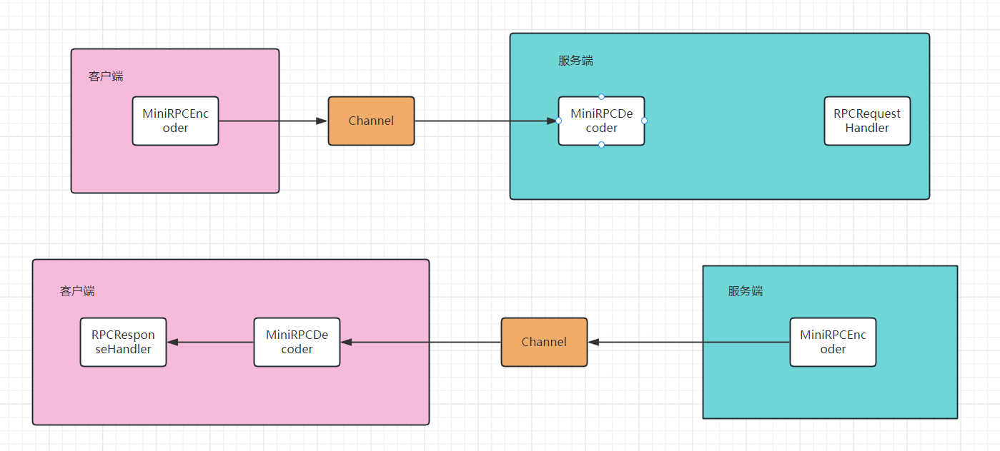

# rpc-调用框架
1. 概述
   Mini-RPC是一个为toB服务端设计的RPC通信框架。当前端发起HTTP调用时，会被Consumer端捕获并通过Netty框架使用RPC协议发送到Provider端。
2. 主要功能
   RPC调用：方便地发起RPC远程调用。
   负载均衡：在服务注册时实现负载均衡。
   服务缓存：提供高效的服务缓存功能。
   一致性哈希：确保均匀的请求分布。
   超时重试：在请求超时时重新发起调用。
   异步调用：支持非阻塞的异步调用。
   泛化调用：提供泛化的调用方式。
   心跳检测：确保服务的可用性。
3. 特点
   异步调用：Mini-RPC框架支持高效的异步远程调用，提高服务响应速度。
   服务缓存：使用高效的缓存机制，减少不必要的网络请求和延迟。
   泛化调用
4. 依赖
   要使用Mini-RPC，您需要以下依赖：
~~~xml
<!-- Mini-RPC 核心 -->
<dependency>
    <groupId>com.hzh</groupId>
    <artifactId>rpc-core</artifactId>
    <version>0.0.1-SNAPSHOT</version>
</dependency>
<!-- Curator相关依赖 -->
<dependency>
    <groupId>org.apache.curator</groupId>
    <artifactId>curator-framework</artifactId>
</dependency>
...
~~~
完整的依赖列表请参见项目的pom.xml。

5. 快速启动
   启动外部的Zookeeper注册中心。
   启动Provider:  
        a.在rpc-provider模块中的resource中修改application.properties中的zk暴漏的地址  
        b.启动Provider。  
   启动Consumer:  
        a.在consumer，如果要发送请求，需要在consumer中添加服务端的接口，然后在consumer中进行调用  
        b.在RpcReference注解中修改你的默认值  
架构图：  
   

目前的依赖关系为
rpc-consumer 和 rpc-provider 共同依赖于
rpc-facade rpc-protocol rpc-registry
然后 rpc-registry rpc-protocol依赖于 rpc-spi
然后 rpc-facade 和 rpc-spi 依赖于 rpc-core  
关系图:  
    
rpc-consumer: 这个模块是用于RPC的客户端，用于发起远程调用。
rpc-provider: 这个模块是用于RPC的服务端，用于处理来自客户端的远程调用。
rpc-facade: 这个模块是用于定义服务接口。
rpc-protocol: 这个模块是用于定义RPC的通信协议，如序列化和反序列化消息。
rpc-registry: 这个模块是用于服务注册和发现。
rpc-spi: 这个模块是用于定义一些插件化的接口，允许用户扩展功能。
rpc-core: 这个模块是整个RPC框架的核心，包含了基础的工具和公共代码。
rpc-test: 这个模块是用于测试整个RPC框架的。  
调用图:  
  

领域模型图:
~~~mermaid
graph TD
  A[客户端 Client] -->|发起调用| B[服务端 Server]
  B -->|返回结果| A
  C[服务注册中心 Service Registry] -->|提供服务地址| A
  D[服务提供者 Provider] -->|注册服务| C
  A -->|查询服务| C
  E[通信协议 Protocol] -->|定义通信规则| A
  E -->|定义通信规则| B
  F[序列化 Serialization] -->|转换数据| A
  G[反序列化 Deserialization] -->|转换数据| B
  H[负载均衡 Load Balancer] -->|分配请求| B
  I[网络传输 Transport] -->|传输数据| A
  I -->|传输数据| B
  J[服务发现 Service Discovery] -->|发现新服务| A
~~~

目前已是实现功能:
1. 服务注册,其主要通过zk进行注册，eureka的暂时不支持
2. 自定义协议和解析
3. 代理支持：JDK和javassist，可在consumer中选择代理放肆
4. 负载均衡：目前通过一致性哈希环算法保证负载均衡，并且支持两种哈希，建议使用MurmurHash
5. 连接池支持：在之前版本中consumer会频繁的创建，所以在最新的版本，已使用单一对象进行consumer生成，多个rpc调用通过连接池进行资源释放
6. 资源钩子：在之前版本中，consumer和provider的资源释放都是通过jvm的钩子进行释放，但是在最新版本中，已经通过钩子进行资源回收，后续将考虑是否使用spring的@PreDestroy进行资源释放
7. 超时重试：目前已完成超时重试功能，并且失败之后会等待一段时间进行重试
8. 支持泛化调用：目前已完成泛化调用，但是在调用时需要传入接口的全限定名
9. 完成限流改造：已完成使用令牌桶进行限流，但是在使用时需要在consumer中进行配置
10. 添加了服务缓存，保证无状态调用之后添加了服务缓存
11. 新增SPI模块，目前完成了对代理类型和序列化的SPI扩展
12. 新增上下文，目前客户端和服务端的上下文统一，但是简易有关header和body的部分直接获取
13. 新增了服务端的心跳检测，目前心跳检测是通过netty异步线程进行检测
14. 新增服务直连，目前支持客户端指定服务端ip和端口直接发起调用，但是在生产中不建议使用这种方式
15. 新增熔断技术，目前会对超时请求进行限制，超过一定限制之后会进行熔断，但是在熔断之后会进行一定时间的恢复，恢复之后会重新进行调用
16. 修改了项目中使用的锁，使用了ReenterLock保证线程安全，注意！！hook实例必须写在`com.hzh.consumer.hook.instance`包下面
  
//todo   
系统目前可运行但还有一定的问题，一下为接下来的开发或者修正重点：  
1.监控系统和调用链路，后续考虑是否要接入skysalking，但是skywalking体量较大，后续考虑是否自己实现一个轻量级的链路分析  
2.注册中心的局限性，目前的注册中心只支持zk，后续考虑是否接入eureka，并且引入分布式注册中心是否需要进行适配等问题    ---这个东西交给会er的人做，我没接触过
3.序列化方式添加，目前只支持hessian，jdk，后续考虑是否要引入其他序列化方式 ✔ 已加入protobuf方式
4.服务端的负载均衡，目前的负载均衡只是简单的一致性哈希，后续考虑是否要引入更多的负载均衡算法  
5.考虑是否加入条件路由，标签路由等等 ✔ 初步完成：在dubbo种是在代理的时候并没有完成bean的完全初始化，而是采用一种lazySet的形式
6.部分接口柯里化，目前部分接口还是比较复杂，后续考虑是否要进行柯里化'
7.本地存根修复 ✔
8.9/10日新增任务：是否要在代理编译方式的时候去给每个服务新增Wrapper调用以避免服务的反射开销，使得在调用的时候不是每次都去反射进行调用而是调用了Wrapper
9.9/10日新增任务: 是否要在接收完任务之后，将所有任务全部解析成不同的任务分发到不同的任务池？？现在的的调用虽然也是任务，但是都由一个部分完成
----目前开发会放下速度，因为一些其他原因，后续会继续开发并且优化，目前项目已经可以使用，但是还有一些问题，后续会进行修复-----
10.9/14新增任务:使用Wrapper类来加强其他类的功能，确立了9.10的任务

controller中只存放例子，不考虑健壮性等其他原因  

----  
在进行其他代码改造的时候，如果涉及到对于Reference的改造的时候，一下链路需要注意
1. consumer 和provider需要进行相对应的改造
2. core种需要对serviceMeta进行改造
3. 需要对注册中心进行改造
4. 需要对代理有明确的认识，需要保证在对这方面进行代理的时候，需要进行对代理的适配，因为代理的固有方法的确定